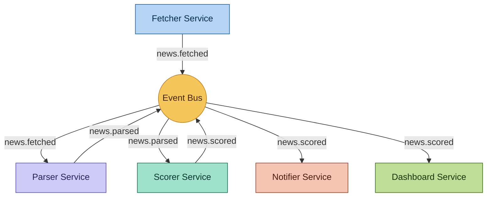

# 📡 NewsRadar

> Agregador de notícias orientado a eventos, construído com arquitetura SOA em Python.


---

## 📌 Sobre o projeto

O **NewsRadar** é um sistema de agregação de notícias construído com **Arquitetura Orientada a Serviços (SOA)** e movido a eventos. Ele busca notícias em APIs públicas, normaliza os dados, pontua a relevância por palavras-chave e exibe um digest formatado no terminal.

O projeto foi desenvolvido com foco em **aprendizado prático de Engenharia de Software**, cobrindo conceitos como:

- Arquitetura SOA e baixo acoplamento entre serviços
- Comunicação orientada a eventos com Event Bus
- Modelagem profissional com diagramas UML
- Boas práticas de documentação e versionamento com Git

---

## 🏗️ Arquitetura

O sistema é composto por **5 serviços independentes** que se comunicam exclusivamente por meio de um barramento de eventos central (Event Bus), sem chamadas diretas entre si.



### Serviços

| Serviço | Responsabilidade | Publica | Consome |
|---|---|---|---|
| **Fetcher** | Busca notícias em APIs públicas | `news.fetched` | — |
| **Parser** | Normaliza e remove duplicatas | `news.parsed` | `news.fetched` |
| **Scorer** | Calcula relevância por palavras-chave | `news.scored` | `news.parsed` |
| **Notifier** | Gera alertas para notícias relevantes | `news.alert` | `news.scored` |
| **Dashboard** | Exibe digest formatado no terminal | — | `news.scored` |

> Diagrama completo de arquitetura em [`docs/architecture.md`](docs/architecture.md)
> Contratos de evento em [`docs/event-contracts.md`](docs/event-contracts.md)

---

## 📁 Estrutura do repositório

```
newsradar/
├── README.md                  ← este arquivo
├── CHANGELOG.md               ← histórico de versões
├── .gitignore
├── docs/
│   ├── architecture.md        ← diagrama SOA detalhado
│   ├── event-contracts.md     ← payload JSON de cada evento
│   ├── use-cases.md           ← casos de uso
│   └── diagrams/              ← arquivos .drawio e imagens
├── src/
│   ├── event_bus/             ← barramento de eventos
│   ├── fetcher/               ← serviço de busca
│   ├── parser/                ← serviço de normalização
│   ├── scorer/                ← serviço de pontuação
│   ├── notifier/              ← serviço de alertas
│   └── dashboard/             ← serviço de exibição
└── tests/                     ← testes por serviço
```

---

## 🚀 Roadmap

- [x] Modelagem da arquitetura SOA
- [x] Estrutura do repositório
- [ ] Implementação do Event Bus
- [ ] Fetcher Service (NewsAPI)
- [ ] Parser Service
- [ ] Scorer Service
- [ ] Notifier Service
- [ ] Dashboard Service (terminal com `rich`)
- [ ] Testes unitários por serviço
- [ ] Scheduler automático com `APScheduler`

---

## 🛠️ Tecnologias

| Tecnologia | Uso |
|---|---|
| Python 3.11+ | Linguagem principal |
| NewsAPI | Fonte de notícias |
| Rich | Interface no terminal |
| APScheduler | Agendamento de execução |
| Mermaid | Diagramas no Markdown |
| Draw.io | Diagramas de arquitetura |

---

## ▶️ Como executar

> Em desenvolvimento — instruções serão adicionadas na Fase 2.

```bash
# Clone o repositório
git clone https://github.com/SEU_USUARIO/newsradar.git
cd newsradar

# Crie o ambiente virtual
python -m venv venv
venv\Scripts\activate  # Windows

# Instale as dependências
pip install -r requirements.txt

# Execute
python src/main.py
```

---

## 📚 Documentação

| Documento | Descrição |
|---|---|
| [`docs/architecture.md`](docs/architecture.md) | Arquitetura SOA detalhada |
| [`docs/event-contracts.md`](docs/event-contracts.md) | Contratos de evento (payload JSON) |
| [`docs/use-cases.md`](docs/use-cases.md) | Casos de uso do sistema |
| [`CHANGELOG.md`](CHANGELOG.md) | Histórico de versões |

---

## 🎯 Objetivo de aprendizado

Este projeto foi desenvolvido para estudo prático de:

- **Arquitetura SOA** — separação de responsabilidades, baixo acoplamento, reusabilidade de serviços
- **Orientação a eventos** — publish/subscribe, contratos de evento, barramento de mensagens
- **Engenharia de Software** — modelagem UML, documentação técnica, versionamento semântico
- **Boas práticas Git** — Conventional Commits, estrutura de repositório, changelog

---

## 👤 Autor

Feito por **Igor Martins** — Analista de Sistemas com foco no backend.

[](https://www.linkedin.com/in/igor-martins1)
[](https://github.com/igormartins87)

---

## 📄 Licença

Este projeto está sob a licença MIT. Veja o arquivo [LICENSE](LICENSE) para mais detalhes.
