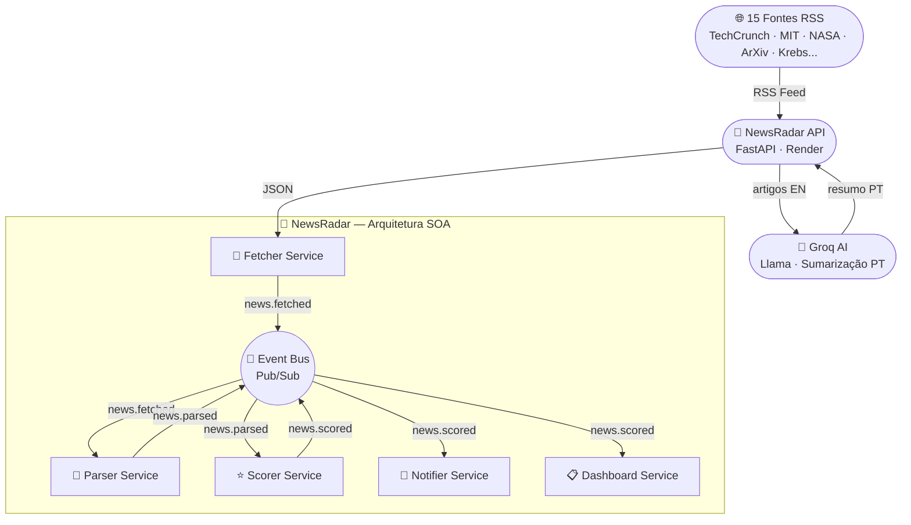

# 📡 NewsRadar

<div align="center">


[](https://newsradar-api-s8id.onrender.com)
[](https://python.org)
[](https://fastapi.tiangolo.com)
[](tests/)
[](docs/architecture.md)
[](docs/security.md)
[](https://newsradar-api-s8id.onrender.com)
[](LICENSE)

**Agregador inteligente de notícias de tecnologia, IA, ciência e segurança — com sumarização por IA e arquitetura SOA orientada a eventos.**

[🚀 API ao Vivo](https://newsradar-api-s8id.onrender.com) • [📖 Swagger](https://newsradar-api-s8id.onrender.com/docs) • [🌐 Dashboard](https://igormartins87.github.io/newsradar) • [📋 Event Contracts](docs/event-contracts.md)

</div>

---

## 🎯 Sobre o projeto

O **NewsRadar** é um sistema de agregação de notícias construído do zero com **Arquitetura Orientada a Serviços (SOA)** e comunicação por eventos. Ele agrega notícias de 15 fontes especializadas em tecnologia, inteligência artificial, ciência e segurança — filtra por relevância, traduz e resume artigos em inglês com IA, e serve tudo via API REST segura com dashboard web.

### O que torna esse projeto diferente

- 🏗️ **Modelagem primeiro** — diagramas UML e contratos de evento antes de qualquer linha de código
- 🤖 **IA integrada** — sumarização e tradução automática de artigos em inglês via Groq/Llama
- 🔒 **Segurança por design** — OWASP, XSS, SSRF, headers HTTP, rate limiting desde o início
- 📡 **SOA real** — 5 serviços independentes comunicando via Event Bus Pub/Sub
- 🧪 **81 testes** — cobertura completa de todos os serviços e componentes
- ⚡ **Cache inteligente** — TTL de 30 minutos com scheduler automático a cada 25 minutos

---

## 🏗️ Arquitetura SOA

O sistema é composto por **5 serviços independentes** que se comunicam exclusivamente via **Event Bus** central — nenhum serviço conhece o outro diretamente.



### Serviços

| Serviço | Responsabilidade | Publica | Consome |
|---|---|---|---|
| **Fetcher** | Busca notícias na API | `news.fetched` | — |
| **Parser** | Normaliza e remove duplicatas | `news.parsed` | `news.fetched` |
| **Scorer** | Calcula relevância por tópicos | `news.scored` | `news.parsed` |
| **Notifier** | Gera alertas para score alto | `news.alert` | `news.scored` |
| **Dashboard** | Exibe digest no terminal | — | `news.scored` |

---

## 🌐 Dashboard Web

Dashboard online com dark/light mode, filtros por categoria e idioma, e resumos em português gerados por IA para notícias em inglês.

**Acesse:** [igormartins87.github.io/newsradar](https://igormartins87.github.io/newsradar)

### Funcionalidades

- 📰 **15 fontes** — Brasil, Tecnologia, IA, Pesquisa, Segurança
- 🤖 **Resumo por IA** — artigos EN resumidos e traduzidos automaticamente
- 🏷️ **Filtro por categoria** — Brasil, Tecnologia, IA, Pesquisa, Segurança, Tendências
- 🌍 **Filtro por idioma** — PT 🇧🇷 e EN 🇺🇸 separados
- ⚙️ **Tópicos configuráveis** — personalize seus interesses com localStorage
- 🌙 **Dark/Light mode** — preferência salva entre sessões
- 📊 **Score visual** — barra de relevância colorida em cada card

---

## 📰 Fontes de Notícias

| Categoria | Fontes |
|---|---|
| 🇧🇷 **Brasil** | G1 Tecnologia, Canaltech, TecMundo |
| 💻 **Tecnologia** | Ars Technica, TechCrunch, The Verge, Wired, MIT Tech Review |
| 🤖 **IA** | Papers With Code, Import AI, The Batch (DeepLearning.ai) |
| 🔬 **Pesquisa** | arXiv CS.AI, arXiv CS.LG |
| 🔐 **Segurança** | Krebs on Security |

---

## 🔌 API REST

API hospedada no Render, disponível 24h com scheduler automático para manter o cache sempre atualizado.

```
Base URL: https://newsradar-api-s8id.onrender.com
```

### Endpoints

| Método | Rota | Auth | Descrição |
|---|---|---|---|
| `GET` | `/` | — | Health check |
| `GET` | `/news/public` | — | Notícias para o dashboard |
| `GET` | `/news/` | API Key | Todas as fontes |
| `GET` | `/news/{source}` | API Key | Fonte específica |
| `GET` | `/news/category/{cat}` | — | Por categoria |
| `GET` | `/news/sources` | — | Lista fontes e categorias |
| `GET` | `/news/cache/info` | API Key | Estado do cache |
| `GET` | `/news/cache/clear` | API Key | Limpa o cache |
| `GET` | `/news/scheduler/status` | API Key | Status do scheduler |

### Exemplo

```bash
curl https://newsradar-api-s8id.onrender.com/news/public?limit=5
```

```json
{
  "status": "ok",
  "articles": [
    {
      "title": "Physicists just found a tiny glitch in time itself",
      "source_name": "SCIENCEDAILY",
      "language": "en",
      "score": 6.0,
      "matched_topics": ["space", "quantum"],
      "ai_summary": "Pesquisadores descobriram que teorias quânticas não convencionais sugerem uma incerteza fundamental no tempo.",
      "has_ai_summary": true
    }
  ]
}
```

---

## 🔒 Segurança — OWASP

| Controle | Implementação |
|---|---|
| **Autenticação** | API Key via header `X-API-Key` |
| **Rate Limiting** | 10 req/min por IP com SlowAPI |
| **HTTPS** | SSL automático via Render |
| **XSS** | Sanitização com Bleach em todos os campos RSS |
| **SSRF** | Allowlist de domínios autorizados no RSSParser |
| **Headers HTTP** | CSP, X-Frame-Options, X-XSS-Protection, HSTS |
| **Variáveis sensíveis** | `.env` — nunca no código |
| **CORS** | Origens e métodos controlados |

---

## ⚡ Performance

| Componente | Estratégia |
|---|---|
| **Cache** | InMemoryCache com TTL de 30 minutos |
| **Scheduler** | Atualização automática a cada 25 minutos |
| **Keep-alive** | Ping a cada 10 minutos — Render nunca dorme |
| **Filtro recência** | Só notícias das últimas 24 horas |
| **Top N** | Máximo 5 artigos por fonte, ordenados por score |

---

## 🧪 Testes

**81 testes passando, 0 falhas.**

```bash
py -m pytest tests/ -v
```

| Módulo | Testes |
|---|---|
| API endpoints | 4 |
| Cache TTL | 6 |
| Dashboard Service | 5 |
| Event Bus | 13 |
| Fetcher Service | 4 |
| Notifier Service | 6 |
| Parser Service | 5 |
| RSS Parser | 21 |
| Scorer Service | 5 |
| AI Summarizer | 12 |

---

## 📁 Estrutura do repositório

```
newsradar/
├── docs/
│   ├── architecture.md        ← diagramas SOA
│   ├── event-contracts.md     ← payloads dos eventos
│   └── use-cases.md
├── src/
│   ├── api/
│   │   ├── main.py            ← FastAPI + middleware de segurança
│   │   ├── cache.py           ← InMemoryCache com TTL
│   │   ├── scheduler.py       ← APScheduler keep-alive + refresh
│   │   ├── summarizer.py      ← AISummarizer via Groq
│   │   ├── rss_parser.py      ← RSS + SSRF + XSS + recência
│   │   ├── security.py        ← API Key validation
│   │   └── routers/
│   │       └── news.py        ← endpoints REST
│   └── event_bus/
│       ├── event.py
│       ├── event_bus.py
│       └── base_service.py
├── tests/                     ← 81 testes
├── docs/index.html            ← dashboard web
├── main.py                    ← orquestrador SOA
└── requirements.txt
```

---

## 🚀 Roadmap

- [x] Arquitetura SOA com Event Bus
- [x] API REST com FastAPI e 15 fontes RSS
- [x] Segurança OWASP completa
- [x] Sumarização IA com Groq
- [x] Cache inteligente com TTL
- [x] Scheduler automático
- [x] Dashboard web com dark/light mode
- [x] 81 testes passando
- [x] Deploy no Render + GitHub Pages
- [ ] Persistência com Supabase
- [ ] Histórico e analytics de tendências
- [ ] Autenticação de usuários com JWT

---

## ▶️ Como executar localmente

```bash
# Clone
git clone https://github.com/igormartins87/newsradar.git
cd newsradar

# Ambiente virtual
python -m venv venv
venv\Scripts\activate  # Windows

# Dependências
pip install -r requirements.txt

# Variáveis de ambiente
cp .env.example .env
# edite o .env com suas chaves

# API
uvicorn src.api.main:app --reload

# Pipeline SOA no terminal
python main.py

# Testes
py -m pytest tests/ -v
```

---

## 🛠️ Tecnologias

| Tecnologia | Uso |
|---|---|
| Python 3.13 | Linguagem principal |
| FastAPI | Framework REST |
| APScheduler | Scheduler automático |
| Groq + Llama | Sumarização por IA |
| Feedparser | Consumo de RSS |
| Bleach | Sanitização XSS |
| SlowAPI | Rate limiting |
| Rich | Interface terminal |
| Pytest | Testes unitários |
| Render | Deploy da API |
| GitHub Pages | Dashboard web |

---

## 👤 Autor

<div align="center">

**Igor Martins de Almeida**

Engenheiro de Software

[](https://linkedin.com/in/igormartins87)
[](https://github.com/igormartins87)

</div>

---

## 📄 Licença

Este projeto está sob a licença MIT.

---

<div align="center">
Feito com 💙 por Igor Martins
</div>
