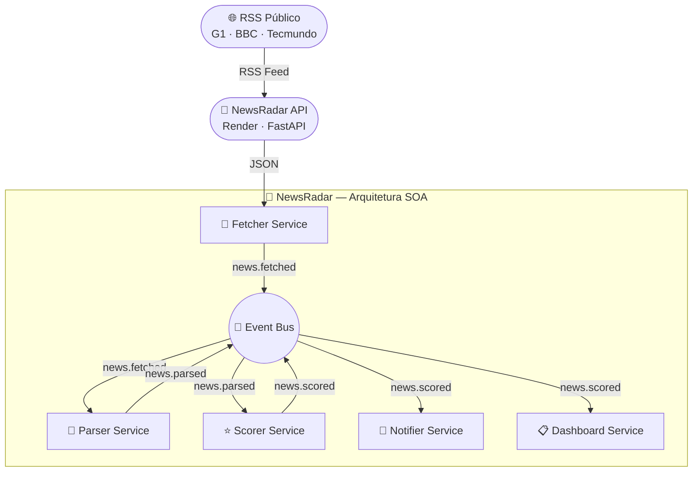

# 📡 NewsRadar

<div align="center">


[](https://newsradar-api-s8id.onrender.com)
[](https://python.org)
[](https://fastapi.tiangolo.com)
[](docs/architecture.md)
[](docs/security.md)
[](https://newsradar-api-s8id.onrender.com)
[](LICENSE)

**API REST de agregação de notícias em tempo real, construída com Arquitetura SOA e orientada a eventos.**

[🚀 API ao Vivo](https://newsradar-api-s8id.onrender.com) • [📖 Documentação](https://newsradar-api-s8id.onrender.com/docs) • [📋 Contratos de Evento](docs/event-contracts.md)

</div>

---

## 🎯 Sobre o projeto

O **NewsRadar** nasceu de uma jornada de aprendizado prático em Engenharia de Software. A ideia foi simples: **antes de escrever uma linha de código, modelar tudo como um engenheiro de verdade faria.**

O projeto agrega notícias em tempo real de fontes públicas (G1, BBC, Tecmundo) via RSS, processa e serve por meio de uma API REST segura — tudo construído sobre uma **Arquitetura Orientada a Serviços (SOA)** com comunicação por eventos.

### O que torna esse projeto diferente

- 🏗️ **Modelagem primeiro** — diagramas UML, contratos de evento e documentação antes do código
- 🔒 **Segurança desde o início** — padrões OWASP aplicados desde a primeira linha
- 🎯 **SOA na prática** — baixo acoplamento, responsabilidade única, pub/sub
- 📚 **Documentação como cidadã de primeira classe** — cada decisão está documentada

---

## 🏗️ Arquitetura SOA

O sistema é composto por **5 serviços independentes** que se comunicam exclusivamente por meio de um **Event Bus** central — nenhum serviço conhece o outro diretamente.



### Serviços

| Serviço | Responsabilidade | Publica | Consome |
|---|---|---|---|
| **Fetcher** | Busca notícias na API | `news.fetched` | — |
| **Parser** | Normaliza e remove duplicatas | `news.parsed` | `news.fetched` |
| **Scorer** | Calcula relevância por palavras-chave | `news.scored` | `news.parsed` |
| **Notifier** | Gera alertas para notícias relevantes | `news.alert` | `news.scored` |
| **Dashboard** | Exibe digest no terminal | — | `news.scored` |

---

## 🔌 API ao Vivo

A API está hospedada no Render e disponível 24h:

```
https://newsradar-api-s8id.onrender.com
```

### Endpoints

| Método | Rota | Descrição |
|---|---|---|
| `GET` | `/` | Health check |
| `GET` | `/news/` | Todas as fontes |
| `GET` | `/news/g1` | Notícias do G1 |
| `GET` | `/news/bbc` | Notícias da BBC |
| `GET` | `/news/tecmundo` | Notícias do Tecmundo |

### Exemplo de uso

```bash
curl -X GET "https://newsradar-api-s8id.onrender.com/news/?limit=5" \
     -H "X-API-Key: sua-chave-aqui"
```

```json
{
  "status": "ok",
  "articles": [
    {
      "id": 123456,
      "title": "OpenAI lança novo modelo com raciocínio avançado",
      "description": "A empresa anunciou...",
      "url": "https://g1.globo.com/...",
      "published_at": "2024-01-15T08:30:00",
      "source_name": "G1"
    }
  ]
}
```

### Documentação interativa

```
https://newsradar-api-s8id.onrender.com/docs
```

---

## 🔒 Segurança — OWASP

| Controle | Implementação |
|---|---|
| **Autenticação** | API Key via header `X-API-Key` |
| **Rate Limiting** | 10 requisições/minuto por IP |
| **HTTPS** | SSL gratuito via Render |
| **Validação** | FastAPI + Pydantic em todos os inputs |
| **Variáveis sensíveis** | `.env` — nunca no código |
| **CORS** | Origens controladas por variável de ambiente |

---

## 📁 Estrutura do repositório

```
newsradar/
├── README.md
├── CHANGELOG.md
├── requirements.txt
├── .env.example
├── docs/
│   ├── architecture.md
│   ├── event-contracts.md
│   └── use-cases.md
├── src/
│   ├── api/
│   │   ├── main.py
│   │   ├── security.py
│   │   ├── rss_parser.py
│   │   └── routers/
│   │       └── news.py
│   └── event_bus/
│       ├── event.py
│       ├── event_bus.py
│       └── base_service.py
└── tests/
    ├── test_event_bus.py
    └── test_api.py
```

---

## 🚀 Roadmap

- [x] Modelagem da arquitetura SOA
- [x] Diagramas UML (componentes, sequência, casos de uso)
- [x] Contratos de evento documentados
- [x] Event Bus com POO (Event, EventBus, BaseService)
- [x] Testes unitários do Event Bus
- [x] API REST com FastAPI e RSS
- [x] Segurança OWASP implementada
- [x] Deploy no Render — API online
- [ ] FetcherService integrado com a API
- [ ] ParserService
- [ ] ScorerService
- [ ] NotifierService
- [ ] Dashboard web visual

---

## 🛠️ Tecnologias

| Tecnologia | Uso |
|---|---|
| Python 3.13 | Linguagem principal |
| FastAPI | Framework da API REST |
| Uvicorn | Servidor ASGI |
| Feedparser | Consumo de feeds RSS |
| SlowAPI | Rate limiting |
| Render | Hospedagem gratuita |
| Pytest | Testes unitários |
| Mermaid | Diagramas no Markdown |

---

## ▶️ Como executar localmente

```bash
# Clone o repositório
git clone https://github.com/igormartins87/newsradar.git
cd newsradar

# Crie o ambiente virtual
python -m venv venv
venv\Scripts\activate  # Windows

# Instale as dependências
pip install -r requirements.txt

# Configure as variáveis de ambiente
cp .env.example .env

# Execute a API
uvicorn src.api.main:app --reload

# Execute os testes
py -m pytest tests/ -v
```

---

## 📚 Documentação

| Documento | Descrição |
|---|---|
| [`docs/architecture.md`](docs/architecture.md) | Arquitetura SOA detalhada |
| [`docs/event-contracts.md`](docs/event-contracts.md) | Contratos de evento |
| [`docs/use-cases.md`](docs/use-cases.md) | Casos de uso |
| [`CHANGELOG.md`](CHANGELOG.md) | Histórico de versões |

---

## 🎓 Jornada de aprendizado

Este projeto faz parte da minha jornada de estudos em **Engenharia de Software e Arquitetura de Sistemas**, com foco na banca **Cesgranrio**.

Cada etapa foi documentada e publicada no LinkedIn mostrando a evolução — da modelagem UML até o deploy em produção.

**Conceitos aplicados na prática:**

- Arquitetura SOA — separação de responsabilidades, baixo acoplamento
- Orientação a eventos — publish/subscribe, contratos de evento
- POO — encapsulamento, abstração, herança, polimorfismo
- Engenharia de Software — modelagem UML, Git Flow, testes unitários
- Segurança — OWASP Top 10, autenticação, rate limiting
- DevOps — deploy automatizado no Render

---

## 👤 Autor

<div align="center">

**Igor Martins de Almeida**

Estudante de Engenharia de Software • Preparação Cesgranrio

[](https://linkedin.com/in/igormartins87)
[](https://github.com/igormartins87)

</div>

---

## 📄 Licença

Este projeto está sob a licença MIT.

---

<div align="center">
Feito com 💙 por Igor Martins — aprendendo Engenharia de Software na prática
</div>
