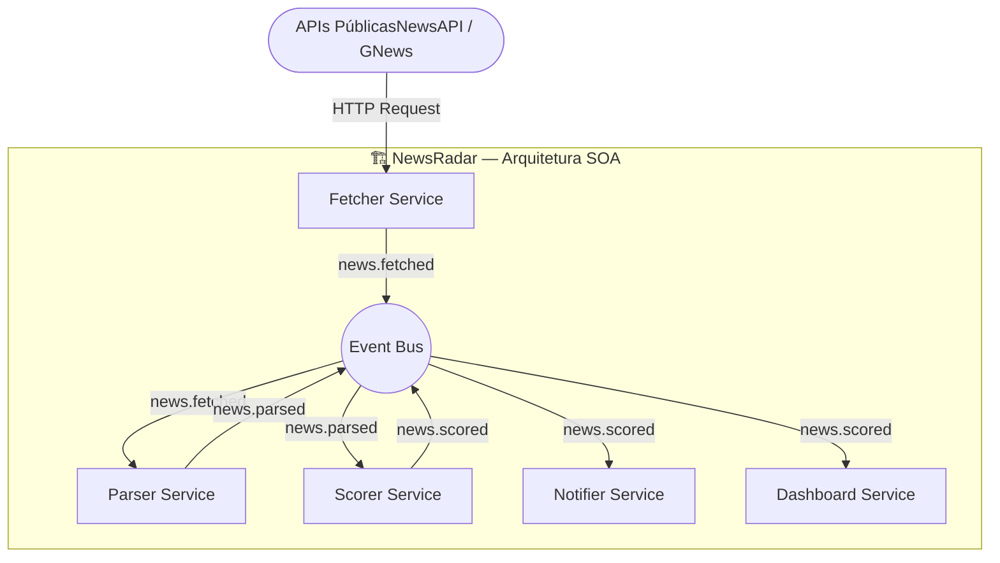
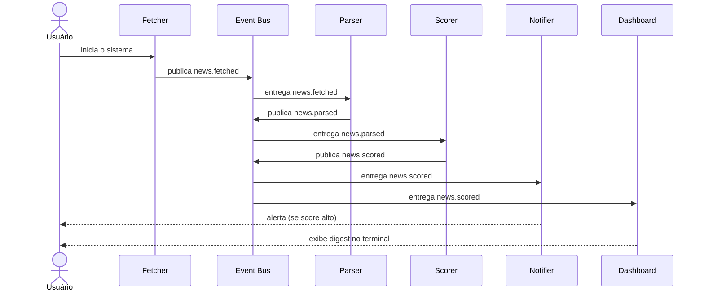

```mermaid
graph TD
    EXT([APIs PúblicasNewsAPI / GNews])

    subgraph SOA["🏗️ NewsRadar — Arquitetura SOA"]
        FE[Fetcher Service]
        PA[Parser Service]
        SC[Scorer Service]
        NO[Notifier Service]
        DA[Dashboard Service]
        EB((Event Bus))
    end

    EXT -->|HTTP Request| FE
    FE -->|news.fetched| EB
    EB -->|news.fetched| PA
    PA -->|news.parsed| EB
    EB -->|news.parsed| SC
    SC -->|news.scored| EB
    EB -->|news.scored| NO
    EB -->|news.scored| DA
```

```mermaid
sequenceDiagram
    actor U as Usuário
    participant FE as Fetcher
    participant EB as Event Bus
    participant PA as Parser
    participant SC as Scorer
    participant NO as Notifier
    participant DA as Dashboard

    U->>FE: inicia o sistema
    FE->>EB: publica news.fetched
    EB->>PA: entrega news.fetched
    PA->>EB: publica news.parsed
    EB->>SC: entrega news.parsed
    SC->>EB: publica news.scored
    EB->>NO: entrega news.scored
    EB->>DA: entrega news.scored
    NO-->>U: alerta (se score alto)
    DA-->>U: exibe digest no terminal
```