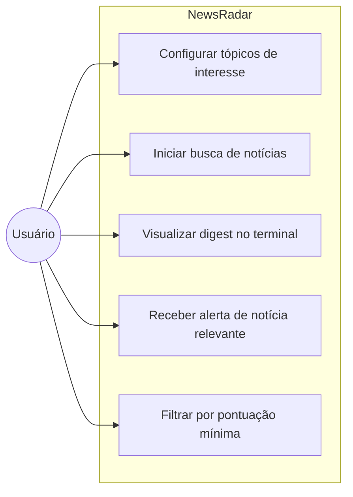

```mermaid
graph LR
    U((Usuário))

    subgraph NewsRadar
        UC1[Configurar tópicos de interesse]
        UC2[Iniciar busca de notícias]
        UC3[Visualizar digest no terminal]
        UC4[Receber alerta de notícia relevante]
        UC5[Filtrar por pontuação mínima]
    end

    U --> UC1
    U --> UC2
    U --> UC3
    U --> UC4
    U --> UC5
```